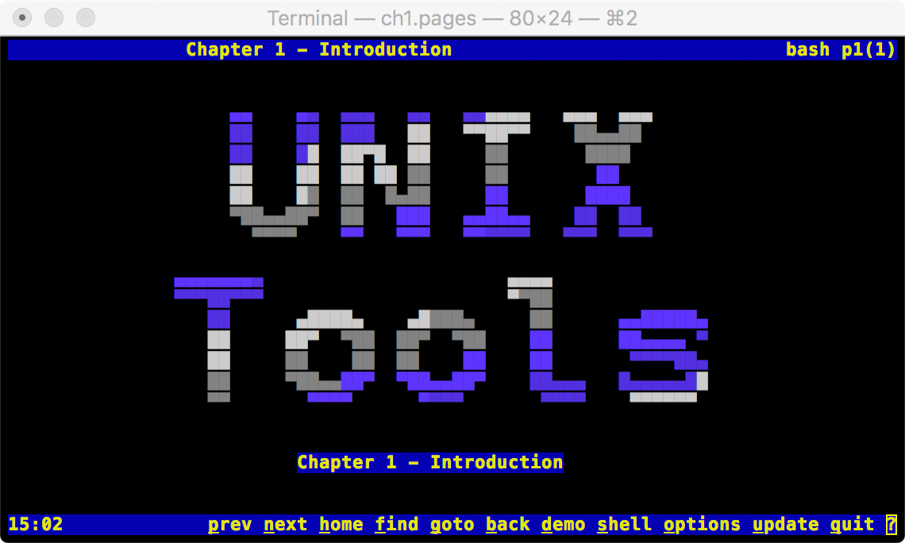

# Learn bash and Unix/Linux tools

The presentation notes are a little bit different than usual.  No powerpoint.  No "slides".

Instead, the interactive TUI presentations are all scripted in bash itself to run on your Unix or Linux machine.

Learning should be enjoyable.  I also had a heck of a lot of fun creating this stuff.

This is what the opening TUI looks like when you run it with `./ch1.pages`:

Some TUI screens include demos and "easter eggs" that run when you press `d` for `demo`.  The demos run in a shell in the `learn/tmp` directory and use the history mechanism.  This is done so that instructors can easily execute the commands from history while explaining.

Pressing `u` for `update` fetches the current pages file from GitHub.  The idea is to allow students to update the presentation when the instructor made changes to it.  If you are an instructor and want to create your own pages, then change `wsite` in `pre-pages` to point to a location from where your `.pages` files can be retrieved.

## Viewing and interacting with the TUI presentations

I wrote this series of lectures for undergraduate computer science students in 2018.  The material is based on *"Linux Commands, Editors, and Shell Programming"* by Mark Sobell, 3rd edition, 2012, Prentice Hall.

- download this repo and change dir to the `learn` directory
- execute `./ch1.pages` to view the first chapter
- if the TUI screen looks garbled, then exit the TUI by pressing `q` and make sure your `TERM` environment variable is set to `ansi` or `xterm` by executing `export TERM=ansi` in bash or`setenv TERM ansi` in csh or tcsh

There is a TUI script for each chapter and subject:

| TUI script   | chapter - topic        |
| ------------ | ---------------------- |
| `ch1.pages`  | 1 - Introduction       |
| `ch2.pages`  | 2 - Getting Started    |
| `ch3.pages`  | 3 - Utilities          |
| `ch4.pages`  | 4 - The Filesystem     |
| `ch5.pages`  | 5 - The Shell          |
| `ch6.pages`  | 6 - The Vim Editor     |
| `ch7.pages`  | 7 - The Emacs Editor   |
| `ch8.pages`  | 8 - Bash               |
| `ch10.pages` | 10 - Bash Programming  |
| `ch14.pages` | 14 - how to use AWK    |
| `ch15.pages` | 15 - how to use SED    |
| `gdb.pages`  | extra - how to use GDB |

## How does it work?

A Makefile executes a `gen-pages` AWK script that converts annotated `.txt` files to `.pages` bash scripts that each drive a TUI.  There is no need to generate `.pages` scripts from `.txt` sources, unless you want to update or generate new scripts.

The `gen-pages` AWK script uses `pre-pages` as a common prelude script.  The `pre-pages` prelude can be changed to update the TUI layout and functionality for all presentations by rebuilding the `.pages` scripts.

The `demo.txt` demo pages source explains how the `.txt` source files are annotated to produce the `demo.pages` script that shows how colors and other TUI artifacts are created.

## License

GPL license.
Copyright Robert van Engelen, 2018.
